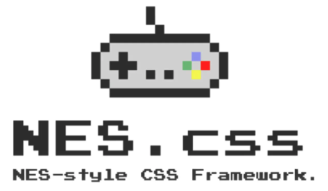

# <-- H  O  O  K  S  H  O  T -->
*A digital field guide for busy Hyrulian explorers*
* [Deployed Page](https://hookshot-app.herokuapp.com)

## Table of Contents
* [Description](#description)
* [Features](#features)
* [Installation](#installation)
* [Demonstration](#demonstration)
* [Developer](#developer)
* [Technologies](#technologies)

## Description

HOOKSHOT is a web app for the aspirant Zelda player - for those who year to disappear into the vast world of *Hyrule*, but simply don't have the time to do so.  By allowing a user to choose a specific "goal" in Nintendo's *Breath of the Wild* game, this interactive data rendering tool provides even the busiest would-be gamer with the specific information needed to dabble as effiiently as possible.    

## Features

* A catered, "location-specific" experience: immediately on launch of the root page, the user can select any location on the game map to proceed.
* "Choose Your Adventure": once their player-location has been selected, the user can then click any of six different "goal" buttons, each filtering game data down to a different category: **creatures**, **equipment**, **treasure**, **monsters**, **materials**, or a final "*Roll the Dice*" option to randomly select one of the five.
* Detailed item/creature data: once a "goal" has been selected, the user is presented with all data that matches both the selected location and selected goal. These matches are used to build and display individual "cards" utilizing an assortment of proprietary stats that vary by category.
* Never a dull moment: if no matches are found, the user is presented with alternative data using the same "goal" preference but different locations around the map.

## Installation

1. Clone this repo using:
  * `git clone`  `https://github.com/pcmueller/Hookshot.git`
2. `cd` into your cloned directory
3. Run `npm install`
4. Run `npm start`

#### Learn More

You can learn more about creating apps using `React` and `JSX` here: [Create React App Documentation](https://create-react-app.dev/docs/getting-started/)

For more about combining `React` with `Redux` here: [React Redux Documentation](https://react-redux.js.org/introduction/getting-started)

#### Cypress Testing

1. Once the app is set up locally, from the root directory, install `Cypress`
  * Run `npm install cypress --save-dev`
2. To open and run the tests
  * Run `npx cypress open`

## Demonstration

## Developer

<table>
    <tr>
        <td> Peter Muellerleile <a href="https://github.com/pcmueller">GH</td>
    </tr>
    </tr>
        <td></td>
    </tr>
</table>

## Technologies

<table>
    <tr>
        <td>JavaScript</td>
        <td>HTML5</td>
        <td>Sass</td>
        <td>NES.css</td>
        <td>React</td>
        <td>Hooks</td>
        <td>Router</td>
        <td>NPM</td>
        <td>Cypress</td>
    </tr>
    <tr>
        <td></td>
        <td></td>
        <td></td>
        <td></td>
        <td></td>
        <td></td>
        <td></td>
        <td></td>
        <td></td>
    </tr>
</table>
